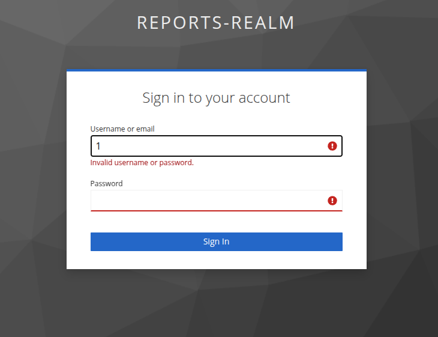
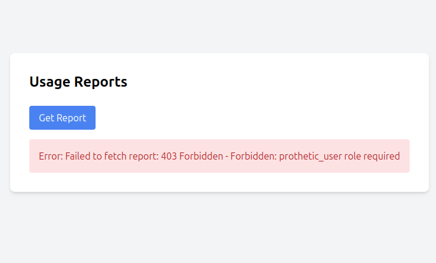
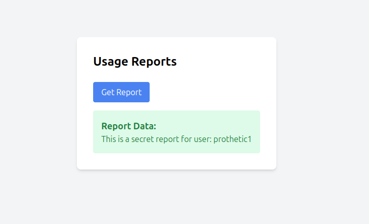

# Объединение сервисов через SSO и работа с данными для аналитики

## Keycloak

В конфигурацию keycloak была добавлена опция

```json
{
  // ....
  "attributes": {
    "pkce.code.challenge.method": "S256"
  }  
}
```
       

## Backend

В качестве языка программирования был выбран golang, как основной на моей текущей работе. Приложение собирается с помощью билдера, так же в итоговый образ добавлен скрипт, который ожидает запуск сервиса keycloak. Так как на моей машине порт 8000 уже занят, то я его изменил на 5001.

## Frontend

В инициализацию ReactKeycloakProvider был добавлен код

```ts
  initOptions={{
        onLoad: 'login-required',
        pkceMethod: 'S256'
      }}
```

Так же для удобства отладки был немного изменён код `ReportPage.tsx`, что бы вместо скачивания данных отчёта, он показывался сразу на странице.

## Проверка

### Сборка и запуск

```bash
docker compose up --build -d
```

### Неверные креды



### Не та роль



### Успех

